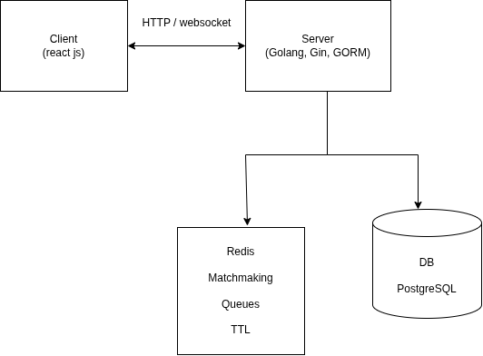

# Real-Time Multiplayer Chess Platform

A low-latency, real-time multiplayer chess platform built to explore concurrent
systems design, matchmaking, authoritative game-state management, and
WebSocket-based communication at scale.

## Features

- **Category-based matchmaking** - players are queued and matched by game
  category using Redis.
- **Move validation (server + client)** - moves are validated on the client
  for instant feedback and re-validated on the server as the source of truth,
  preventing illegal moves and client-side tampering.
- **Server-authoritative game state** - each match's state (board position,
  turn, move history) is tracked and synchronized in real time across both
  players.
- **Game clocks via Redis keyspace notifications** - per-game time controls
  are enforced using Redis key expiration events rather than in-process
  timers, so time-outs are handled reliably even under server load.
- **Disconnection handling** - a server-side heartbeat monitors each
  connection and detects player disconnects without relying on the client to
  self-report.
- **Post-game analysis** - completed games are analyzed using the Stockfish
  engine, with results displayed to the client.
- **Player ratings (Glicko-1)** - player skill is tracked and updated after
  each game using the Glicko-1 rating system.

## Architecture



The client and server are independent, standalone codebases, the frontend
talks to the backend only over WebSocket/HTTP, with no shared code or
monorepo tooling between them.

On the backend, connections are held in a single server process since both
players in a given match are handled in-memory on the same instance, moves
are relayed directly between sockets without needing a message broker. This
keeps the system simple at current scale; a pub/sub layer (e.g. Redis
Pub/Sub) would be introduced if the platform needed to horizontally scale
across multiple server instances, so that players on different instances
could still reach each other.

## Tech Stack

| Layer      | Technology                          |
|------------|--------------------------------------|
| Client     | React js                             |
| Server     | Go, Gin, GORM                        |
| Real-time  | WebSockets                           |
| Cache / Coordination | Redis (matchmaking queues, keyspace notifications for clocks) |
| Database   | PostgreSQL                           |
| Analysis   | Stockfish engine                     |

## Repositories

This project is split across two standalone repos:

| Repo | Description |
|------|-------------|
| [`chess_client`](<https://github.com/AhmedMilad/chess_client>) | React js |
| [`chess_server`](<https://github.com/AhmedMilad/chess_server>) | Go backend (Gin, GORM, Redis, WebSockets) |

### Prerequisites

- Go 1.2x+
- Node.js 1x+
- PostgreSQL
- Redis
- Stockfish binary (for post-game analysis)

### Setup

Clone the repo:

```bash
git clone <https://github.com/AhmedMilad/chess_server.git> chess_server
cd chess_server
cp .env.example .env   # configure DB / Redis connection strings
go mod tidy
go run .
```

### Environment Variables

```dotenv
DEBUG=
DB_HOST=
DB_USER=
DB_PASSWORD=
DB_NAME=
DB_PORT=
JWT_SECRET_KEY=
DB_SSLMODE=
REDIS_ADDRESS=
REDIS_PASSWORD=
REDIS_DB=
CLIENT_BASE_URL=
DOMAIN=
```

| Variable | Description |
| ---------- | -------------- |
| `DEBUG` | set it based on the mode you are running on (prod / dev) |
| `DB_HOST` | PostgreSQL host |
| `DB_USER` | PostgreSQL user |
| `DB_PASSWORD` | PostgreSQL password |
| `DB_NAME` | PostgreSQL database name |
| `DB_PORT` | PostgreSQL port |
| `DB_SSLMODE` | PostgreSQL SSL mode |
| `JWT_SECRET_KEY` | Secret used to sign/verify JWT auth tokens |
| `REDIS_ADDRESS` | Redis host:port |
| `REDIS_PASSWORD` | Redis password |
| `REDIS_DB` | Redis logical DB index |
| `CLIENT_BASE_URL` | Base URL of the frontend (used for CORS / redirects) |
| `DOMAIN` | Domain the server is served under |

## How It Works

1. A player joins the queue for a game category; matchmaking pairs players
   via a Redis queue.
2. Once matched, a game session is created and both players connect over
   WebSocket.
3. Moves are validated client-side for responsiveness, then re-validated
   server-side before being broadcast and persisted.
4. Each game's clock is tracked via a Redis key with a TTL; when it expires,
   a keyspace notification fires and the server ends the game on time.
5. A heartbeat check on each connection detects disconnects and updates game
   state accordingly.
6. After the game ends, Stockfish analyzes the move history and returns
   analysis to both players, and each player's Glicko-1 rating is updated
   based on the result.

## Testing

The backend includes automated tests covering game move logic (validation,
legal move generation, and edge cases) to guard against regressions in the
core rules engine.

```bash
cd chess_server
go test ./...
```

## Roadmap / Possible Extensions

- Horizontal scaling with a Redis Pub/Sub coordination layer for
  cross-instance communication.
- Spectator mode.

## License

> _MIT License_
